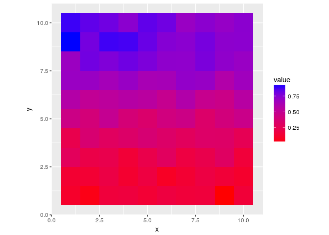
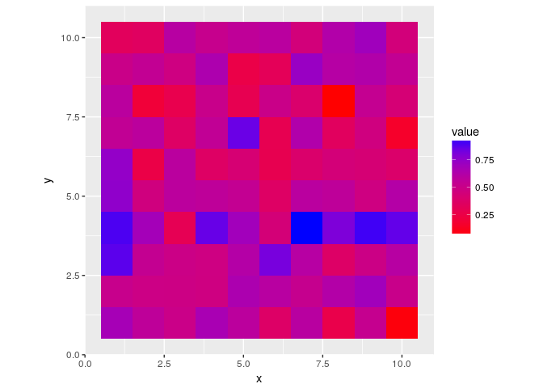
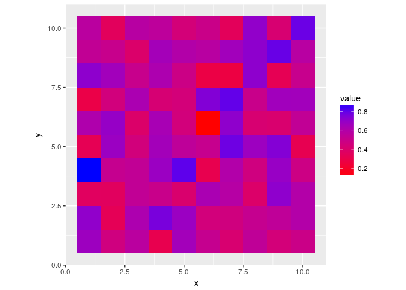

<!-- README.md is generated from README.Rmd. Please edit that file -->
motifator
=========

The goal of motifator is to allow users to generate spatial motifs that replicate the ones seen in real-world data, without including any potentially identifying information.

Installation
------------

You can install motifator from github with:

``` r
# install.packages("devtools")
devtools::install_github("jzelner/motifator")
```

Example
-------

Consider this example: You want to compare the impact of spatial clustering of different levels of vaccination coverage in a model of infectious disease transmission. So, let's make a map where we assume that about 50% of the population is vaccinated, but there is no spatial clustering.

Our metric of spatial clustering for this example is Moran's I. Theoretical values of I run from -1 to 1. I = -1 implies *anticorrelation*, in which neighboring cells have values that are maximally different from each other. By contrast, values closer to +1 indicate strong spatial *autocorrelation*.

Let's sample a map with strong spatial correlation:

``` r
require(motifator)
#> Loading required package: motifator
#> Loading required package: Rcpp
m <- sampleProportion(10, i_target = 0.9, mean_target = 0.5)
#> Joining, by = c("x", "y")
#> 
#> SAMPLING FOR MODEL 'gpcor' NOW (CHAIN 1).
#> 
#> Gradient evaluation took 0.001615 seconds
#> 1000 transitions using 10 leapfrog steps per transition would take 16.15 seconds.
#> Adjust your expectations accordingly!
#> 
#> 
#> Iteration:   1 / 1000 [  0%]  (Warmup)
#> Iteration: 100 / 1000 [ 10%]  (Warmup)
#> Iteration: 200 / 1000 [ 20%]  (Warmup)
#> Iteration: 300 / 1000 [ 30%]  (Warmup)
#> Iteration: 400 / 1000 [ 40%]  (Warmup)
#> Iteration: 500 / 1000 [ 50%]  (Warmup)
#> Iteration: 501 / 1000 [ 50%]  (Sampling)
#> Iteration: 600 / 1000 [ 60%]  (Sampling)
#> Iteration: 700 / 1000 [ 70%]  (Sampling)
#> Iteration: 800 / 1000 [ 80%]  (Sampling)
#> Iteration: 900 / 1000 [ 90%]  (Sampling)
#> Iteration: 1000 / 1000 [100%]  (Sampling)
#> 
#>  Elapsed Time: 25.3592 seconds (Warm-up)
#>                22.5426 seconds (Sampling)
#>                47.9018 seconds (Total)
#> Warning: There were 1 divergent transitions after warmup. Increasing adapt_delta above 0.8 may help. See
#> http://mc-stan.org/misc/warnings.html#divergent-transitions-after-warmup
#> Warning: There were 1 chains where the estimated Bayesian Fraction of Missing Information was low. See
#> http://mc-stan.org/misc/warnings.html#bfmi-low
#> Warning: Examine the pairs() plot to diagnose sampling problems
plotMap(m)
```



This results in an average *I* value of 0.79 and an average proportion of 0.51.

Now for comparison, let's do the same thing but for a `10 x 10` map with no spatial structure and the same mean:

``` r
m <- sampleProportion(10, i_target = 0.0, mean_target = 0.5)
#> Joining, by = c("x", "y")
#> 
#> SAMPLING FOR MODEL 'gpcor' NOW (CHAIN 1).
#> 
#> Gradient evaluation took 0.001442 seconds
#> 1000 transitions using 10 leapfrog steps per transition would take 14.42 seconds.
#> Adjust your expectations accordingly!
#> 
#> 
#> Iteration:   1 / 1000 [  0%]  (Warmup)
#> Iteration: 100 / 1000 [ 10%]  (Warmup)
#> Iteration: 200 / 1000 [ 20%]  (Warmup)
#> Iteration: 300 / 1000 [ 30%]  (Warmup)
#> Iteration: 400 / 1000 [ 40%]  (Warmup)
#> Iteration: 500 / 1000 [ 50%]  (Warmup)
#> Iteration: 501 / 1000 [ 50%]  (Sampling)
#> Iteration: 600 / 1000 [ 60%]  (Sampling)
#> Iteration: 700 / 1000 [ 70%]  (Sampling)
#> Iteration: 800 / 1000 [ 80%]  (Sampling)
#> Iteration: 900 / 1000 [ 90%]  (Sampling)
#> Iteration: 1000 / 1000 [100%]  (Sampling)
#> 
#>  Elapsed Time: 13.0166 seconds (Warm-up)
#>                9.53646 seconds (Sampling)
#>                22.5531 seconds (Total)
#> Warning: There were 1 chains where the estimated Bayesian Fraction of Missing Information was low. See
#> http://mc-stan.org/misc/warnings.html#bfmi-low
#> Warning: Examine the pairs() plot to diagnose sampling problems
plotMap(m)
```



This results in an average *I* value of 0.04 and an average proportion of 0.50.

And with anti-correlation:

``` r
m <- sampleProportion(10, i_target = -0.9, mean_target = 0.5)
#> Joining, by = c("x", "y")
#> 
#> SAMPLING FOR MODEL 'gpcor' NOW (CHAIN 1).
#> 
#> Gradient evaluation took 0.001501 seconds
#> 1000 transitions using 10 leapfrog steps per transition would take 15.01 seconds.
#> Adjust your expectations accordingly!
#> 
#> 
#> Iteration:   1 / 1000 [  0%]  (Warmup)
#> Iteration: 100 / 1000 [ 10%]  (Warmup)
#> Iteration: 200 / 1000 [ 20%]  (Warmup)
#> Iteration: 300 / 1000 [ 30%]  (Warmup)
#> Iteration: 400 / 1000 [ 40%]  (Warmup)
#> Iteration: 500 / 1000 [ 50%]  (Warmup)
#> Iteration: 501 / 1000 [ 50%]  (Sampling)
#> Iteration: 600 / 1000 [ 60%]  (Sampling)
#> Iteration: 700 / 1000 [ 70%]  (Sampling)
#> Iteration: 800 / 1000 [ 80%]  (Sampling)
#> Iteration: 900 / 1000 [ 90%]  (Sampling)
#> Iteration: 1000 / 1000 [100%]  (Sampling)
#> 
#>  Elapsed Time: 12.2454 seconds (Warm-up)
#>                9.7475 seconds (Sampling)
#>                21.9929 seconds (Total)
#> Warning: There were 1 chains where the estimated Bayesian Fraction of Missing Information was low. See
#> http://mc-stan.org/misc/warnings.html#bfmi-low
#> Warning: Examine the pairs() plot to diagnose sampling problems
plotMap(m)
```



This results in an average *I* value of -0.14 and an average proportion of 0.50. This value is a bit short of our target value of I, but we can see that the variance of the cell values has increased significantly. Acheiving the theoretical maximum value of -1 may be particularly infeasible for continuous outputs constrained to (0,1) because it necessitates a perfectly inverse relationship in the value of neighboring cells. Future iterations should pre-derive the minimum and maximum values of *I* given the output range and allow users to set the correlation parameter as a function of this range.
